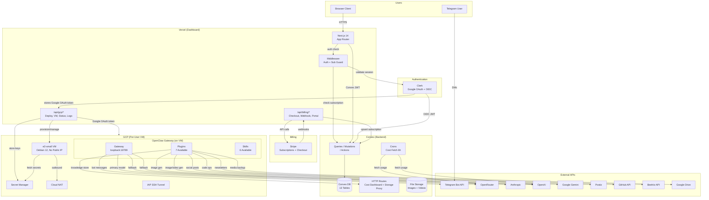
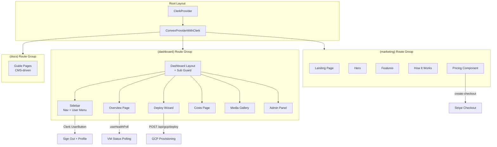
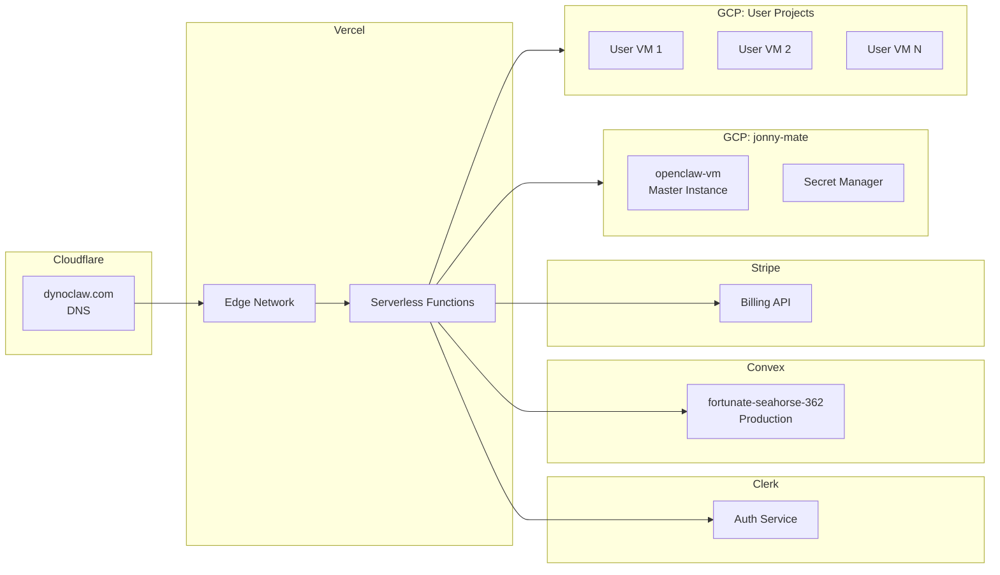

# Architecture Diagram

## Full System Overview

```mermaid
graph TB
    subgraph Users
        Browser[Browser Client]
        TGUser[Telegram User]
    end

    subgraph Vercel["Vercel (Dashboard)"]
        Next[Next.js 14<br/>App Router]
        MW[Middleware<br/>Auth + Sub Guard]
        API_GCP["/api/gcp/*<br/>Deploy, VM, Status, Logs"]
        API_Bill["/api/billing/*<br/>Checkout, Webhook, Portal"]
    end

    subgraph Auth["Authentication"]
        Clerk[Clerk<br/>Google OAuth + OIDC]
    end

    subgraph Backend["Convex (Backend)"]
        ConvexDB[(Convex DB<br/>13 Tables)]
        ConvexFn[Queries / Mutations<br/>/ Actions]
        ConvexHTTP[HTTP Routes<br/>Cost Dashboard + Storage Proxy]
        ConvexCron[Crons<br/>Cost Fetch 6h]
        ConvexStorage[(File Storage<br/>Images + Videos)]
    end

    subgraph Billing
        Stripe[Stripe<br/>Subscriptions + Checkout]
    end

    subgraph GCP["GCP (Per-User VM)"]
        SM[Secret Manager]
        VM[e2-small VM<br/>Debian 12, No Public IP]
        NAT[Cloud NAT]
        IAP[IAP SSH Tunnel]

        subgraph OpenClaw["OpenClaw Gateway (on VM)"]
            GW[Gateway<br/>loopback:18789]
            Plugins[Plugins<br/>7 Available]
            Skills[Skills<br/>6 Available]
        end
    end

    subgraph External["External APIs"]
        TG_API[Telegram Bot API]
        OR[OpenRouter]
        AN[Anthropic]
        OAI[OpenAI]
        Gemini[Google Gemini]
        Postiz[Postiz]
        GH[GitHub API]
        BH[Beehiiv API]
        Drive[Google Drive]
    end

    Browser -->|HTTPS| Next
    Next -->|auth check| MW
    MW -->|validate session| Clerk
    MW -->|check subscription| ConvexFn

    Next -->|Convex JWT| ConvexFn
    API_GCP -->|Google OAuth token| GCP
    API_Bill -->|API calls| Stripe

    Clerk -->|OIDC JWT| ConvexFn
    Clerk -->|stores Google OAuth token| API_GCP

    Stripe -->|webhooks| API_Bill
    API_Bill -->|upsert subscription| ConvexFn

    ConvexFn --> ConvexDB
    ConvexCron -->|fetch usage| OR
    ConvexCron -->|fetch usage| OAI

    API_GCP -->|provision/manage| VM
    API_GCP -->|store keys| SM
    VM -->|fetch secrets| SM
    VM -->|outbound| NAT

    GW -->|bot messages| TG_API
    TGUser -->|DMs| TG_API
    GW -->|primary model| OR
    GW -->|fallback| AN
    GW -->|fallback| OAI

    Plugins -->|social posts| Postiz
    Plugins -->|code ops| GH
    Plugins -->|newsletters| BH
    Plugins -->|image/video gen| Gemini
    Plugins -->|image gen| OAI
    Plugins -->|media backup| Drive
    Plugins -->|knowledge store| ConvexHTTP
```

## Dashboard Component Architecture

```mermaid
graph TB
    subgraph Layout["Root Layout"]
        ClerkProv[ClerkProvider]
        ConvexProv[ConvexProviderWithClerk]
    end

    subgraph Marketing["(marketing) Route Group"]
        Landing[Landing Page]
        Hero[Hero]
        Features[Features]
        HowItWorks[How It Works]
        Pricing[Pricing Component]
    end

    subgraph Dashboard["(dashboard) Route Group"]
        DashLayout[Dashboard Layout<br/>+ Sub Guard]
        Sidebar[Sidebar<br/>Nav + User Menu]
        Overview[Overview Page]
        Deploy[Deploy Wizard]
        Costs[Costs Page]
        Media[Media Gallery]
        Admin[Admin Panel]
    end

    subgraph Docs["(docs) Route Group"]
        Guide[Guide Pages<br/>CMS-driven]
    end

    ClerkProv --> ConvexProv
    ConvexProv --> Marketing
    ConvexProv --> Dashboard
    ConvexProv --> Docs

    DashLayout --> Sidebar
    DashLayout --> Overview
    DashLayout --> Deploy
    DashLayout --> Costs
    DashLayout --> Media
    DashLayout --> Admin

    Pricing -->|create-checkout| Stripe_API[Stripe Checkout]
    Deploy -->|POST /api/gcp/deploy| GCP_Deploy[GCP Provisioning]
    Overview -->|useHealthPoll| Status_API[VM Status Polling]
    Sidebar -->|Clerk UserButton| Auth_UI[Sign Out + Profile]
```

## Infrastructure Topology

```mermaid
graph LR
    subgraph Cloudflare
        DNS[dynoclaw.com<br/>DNS]
    end

    subgraph Vercel
        Edge[Edge Network]
        Serverless[Serverless Functions]
    end

    subgraph Clerk_Cloud["Clerk"]
        ClerkAuth[Auth Service]
    end

    subgraph Convex_Cloud["Convex"]
        ConvexDeploy[fortunate-seahorse-362<br/>Production]
    end

    subgraph Stripe_Cloud["Stripe"]
        StripeAPI[Billing API]
    end

    subgraph GCP_Master["GCP: jonny-mate"]
        MasterVM[openclaw-vm<br/>Master Instance]
        MasterSM[Secret Manager]
    end

    subgraph GCP_User["GCP: User Projects"]
        UserVM1[User VM 1]
        UserVM2[User VM 2]
        UserVMN[User VM N]
    end

    DNS --> Edge
    Edge --> Serverless
    Serverless --> ClerkAuth
    Serverless --> ConvexDeploy
    Serverless --> StripeAPI
    Serverless --> GCP_Master
    Serverless --> GCP_User
```
