# Entity Relationship Diagram

## Convex Schema (13 Tables)

```mermaid
erDiagram
    users ||--o{ deployments : owns
    users ||--o| subscriptions : has
    users ||--o{ costSnapshots : tracks
    users ||--o{ openrouterActivity : tracks
    users ||--o{ media : generates
    users ||--o{ knowledge : stores
    users ||--o{ deployJobs : initiates

    deployments ||--o{ pluginConfigs : configures
    deployments ||--o{ skillConfigs : configures
    deployments ||--o{ apiKeyRegistry : registers
    deployments ||--o{ deployJobs : logs

    users {
        id _id PK
        string clerkId UK "Clerk subject ID"
        string email
        string name
        string pictureUrl
        string role "user | admin"
        string status "active | suspended"
        number lastSeenAt
        number createdAt
    }

    deployments {
        id _id PK
        string userId FK "users._id via clerkId"
        string gcpProject
        string zone
        string vmName
        string status "provisioning | running | stopped | error"
        string botName
        string brandEmoji
        string primaryModel
        string[] fallbackModels
        number createdAt
    }

    subscriptions {
        id _id PK
        string userId FK
        string stripeCustomerId UK
        string stripeSubscriptionId UK
        string status "trialing | active | canceled | past_due | pending"
        string plan "starter | pro"
        number trialEnd
        number currentPeriodEnd
        number createdAt
        number updatedAt
    }

    pluginConfigs {
        id _id PK
        id deploymentId FK
        string userId FK
        string pluginId "e.g. postiz, image-gen"
        boolean enabled
        object config "plugin-specific settings"
    }

    skillConfigs {
        id _id PK
        id deploymentId FK
        string userId FK
        string skillId "e.g. daily-posts"
        boolean enabled
        string cronOverride "optional cron expression"
    }

    apiKeyRegistry {
        id _id PK
        id deploymentId FK
        string userId FK
        string keyName "e.g. anthropic-api-key"
        string maskedValue "first4****last4"
    }

    deployJobs {
        id _id PK
        string userId FK
        id deploymentId FK
        string action "deploy | delete | start | stop | reset"
        string status "pending | running | completed | failed"
        string log "output text"
        number startedAt
        number completedAt
    }

    costSnapshots {
        id _id PK
        string userId FK
        number openrouterBalance
        number openaiSpend
        number gcpEstimate
        number fetchedAt
    }

    openrouterActivity {
        id _id PK
        string userId FK
        string date "YYYY-MM-DD"
        string model "model identifier"
        number requests
        number promptTokens
        number completionTokens
        number totalCostUsd
    }

    media {
        id _id PK
        string userId FK
        string type "image | video"
        string prompt "generation prompt"
        id storageId "Convex file storage ref"
        string driveUrl "Google Drive backup URL"
        string mimeType
        number createdAt
    }

    knowledge {
        id _id PK
        string userId FK
        string text "content chunk"
        float[] embedding "1536-dim vector"
        string source "origin of content"
        number createdAt
    }

    pricingPlans {
        id _id PK
        string slug UK "starter | pro"
        string name "display name"
        number priceMonthly
        number priceYearly
        string stripePriceId
        string[] features
        number sortOrder
        boolean active
    }

    cmsPages {
        id _id PK
        string slug UK
        string title
        string body "markdown content"
        boolean published
        number createdAt
        number updatedAt
    }

    navLinks {
        id _id PK
        string label
        string href
        string section "header | footer | sidebar"
        string placement
        boolean visible
        number sortOrder
    }
```

## Index Summary

| Table | Index | Fields | Purpose |
|-------|-------|--------|---------|
| users | `by_clerkId` | clerkId | Lookup by Clerk subject ID |
| users | `by_role` | role | Admin user queries |
| deployments | `by_userId` | userId | User's deployments |
| deployments | `by_userId_status` | userId, status | Filter by status |
| subscriptions | `by_userId` | userId | User's subscription |
| subscriptions | `by_stripeCustomerId` | stripeCustomerId | Webhook lookup |
| subscriptions | `by_stripeSubscriptionId` | stripeSubscriptionId | Webhook lookup |
| pluginConfigs | `by_deploymentId` | deploymentId | Deployment's plugins |
| pluginConfigs | `by_userId` | userId | User's plugins |
| skillConfigs | `by_deploymentId` | deploymentId | Deployment's skills |
| skillConfigs | `by_userId` | userId | User's skills |
| apiKeyRegistry | `by_deploymentId` | deploymentId | Deployment's keys |
| apiKeyRegistry | `by_userId` | userId | User's keys |
| deployJobs | `by_userId` | userId | User's jobs |
| deployJobs | `by_deploymentId` | deploymentId | Deployment's jobs |
| deployJobs | `by_userId_status` | userId, status | Active jobs |
| costSnapshots | `by_fetchedAt` | fetchedAt | Time-series queries |
| costSnapshots | `by_userId_fetchedAt` | userId, fetchedAt | Per-user time series |
| openrouterActivity | `by_date` | date | Daily aggregation |
| openrouterActivity | `by_date_model` | date, model | Per-model daily |
| openrouterActivity | `by_userId_date` | userId, date | Per-user daily |
| media | `by_type` | type | Filter images vs videos |
| media | `by_createdAt` | createdAt | Recent media |
| media | `by_userId_createdAt` | userId, createdAt | Per-user media |
| knowledge | `by_embedding` | embedding (vector) | Similarity search |
| knowledge | `by_userId` | userId | Per-user knowledge |
| pricingPlans | `by_slug` | slug | Plan lookup |
| cmsPages | `by_slug` | slug | Page lookup |
| navLinks | `by_section` | section | Section filtering |
| navLinks | `by_visible` | visible | Visibility filtering |
