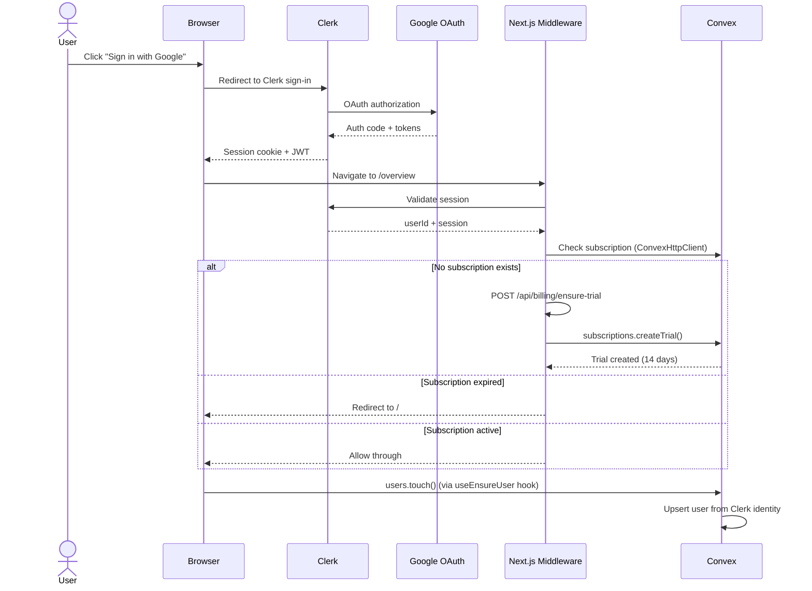
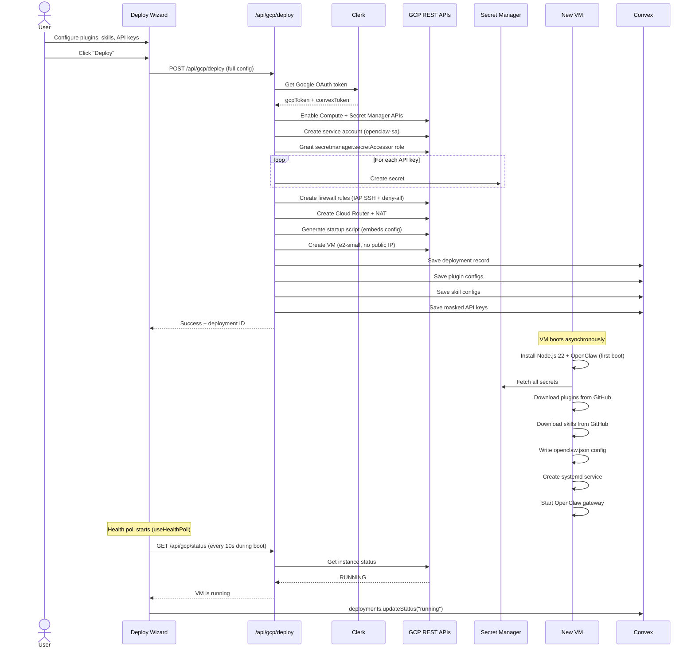
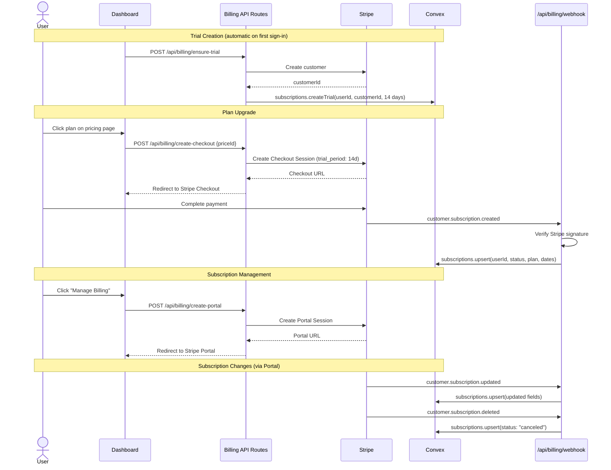
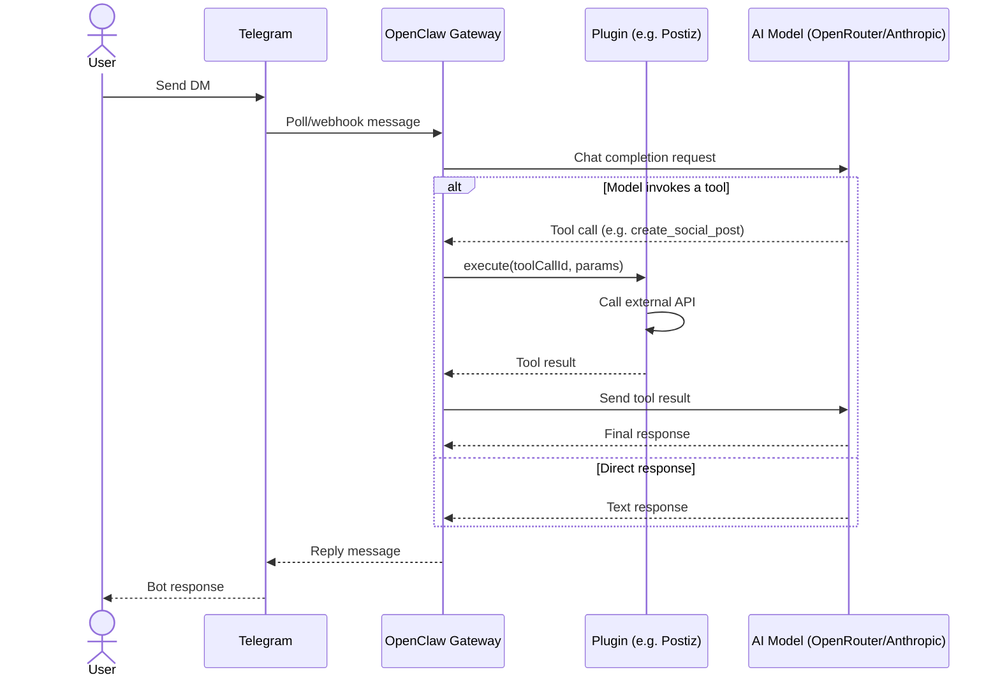
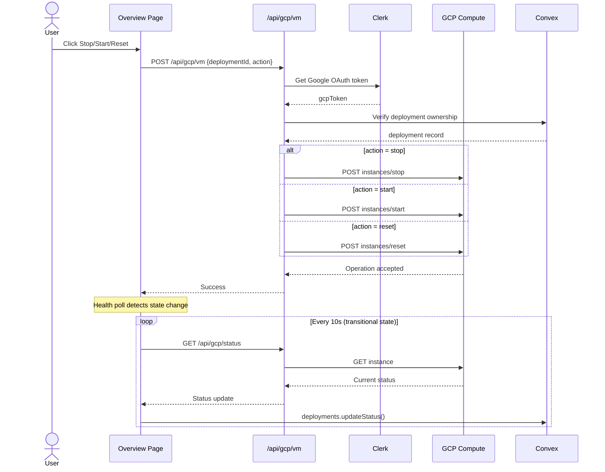
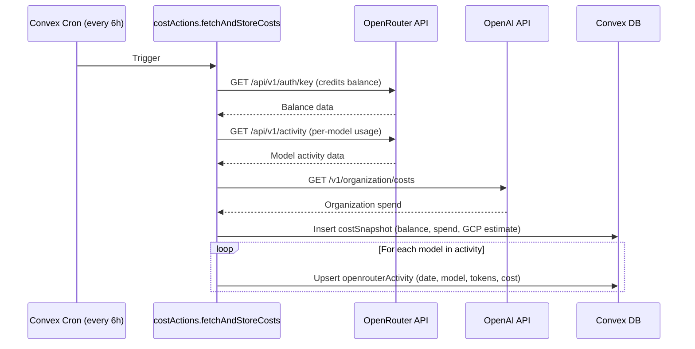
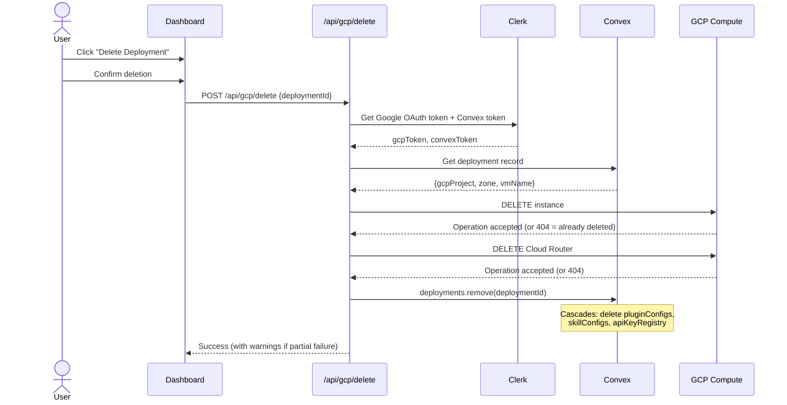

# Sequence Diagrams

## User Sign-In Flow

## Deploy Flow (Dashboard → GCP VM)

## Billing Flow

## Telegram Message Flow

## VM Lifecycle Management

## Cost Tracking Flow

## Deployment Teardown Flow

